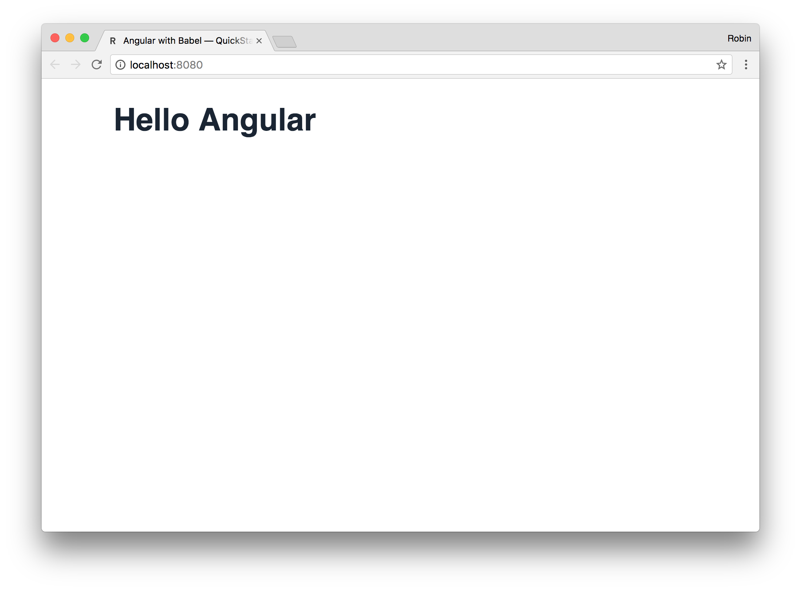

# Angular 2/4 ES6 Seed
  

The super simple [Angular](https://angular.io/) quickstarter with ES6 ([Babel](https://babeljs.io/)) instead of [TypeScript](https://www.typescriptlang.org/). Built with [gulp](http://gulpjs.com/), bundled with [webpack](https://github.com/webpack/webpack).

Based on the official [Angular QuickStarter](https://angular.io/docs/ts/latest/quickstart.html).

## Setup
After cloning or downloading this repo, run the following two commands inside the project folder to get it up and running.

    yarn

    yarn dev

This will install all packages, transpile ES6 to ES5, Sass to CSS, run a server at [localhost:8080](http://localhost:8080) and watch the sources. If you want to additionally minify your project, run `yarn prod` insted of `yarn dev`.

_You can also use npm to install and run this project. However, since I develop with yarn myself, I cannot guarantee it works as intended._

## Guide
### Configuring Babel for Angular
After we've set up our [gulpfile.js](gulpfile.js), we need to install presets for Babel so it knows what language the source code is written in and what framework we use. We do this by installing `babel-preset-env` and `babel-preset-angular2`. When that's done, we need to go ahead and configure `babel-preset-env`. We do that by specifying a `targets` and a `modules` property. In the first one, we tell Babel what web browsers our app should support. The second one prevents Babel from transforming ES6 modules into CommonJS modules, so webpack can do it. All of these rules get written inside the [.babelrc](.babelrc) file.

### Including Stuff in [index.html](src/index.html)
Since Angular uses things that are still experimental and bleeding edge, it's just proper manners to include polyfills for older browsers. By name, these are [core-js](https://github.com/zloirock/core-js), [reflect-metadata](https://www.npmjs.com/package/reflect-metadata), [rxjs](https://www.npmjs.com/package/rxjs) and [zone.js](https://github.com/angular/zone.js/). All of these libraries get concatenated and then minified into bundle.js, which will then be referenced in [index.html](src/index.html). Since we use webpack for bundling, our written Angular code gets included to bundle.js as well. So we do not need to worry about referencing our logic inside the HTML files.

### What's in [package.json](package.json)?
You've probably wondered where all that minty Angular magic comes from. It originates from npm packages. You see all those `@angular/` dependencies? That's it! They then get used in [main.js](src/js/main.js) or [app.module.js](src/js/app.module.js) via `import` statements. Inside package.json, you'll also find the aforementioned polyfills, gulp, Babel and webpack.

## Any Questions?
Hopefully my starter helped understand the unnecessarily complicated setup process for Angular projects. If you need further assistance or encounter any problems, feel free to open an issue. A list of other Angular 2 + Babel starters can be found [here](https://github.com/AngularClass/awesome-angular2#angular-2-in-babel).

## ToDo
* Extend the readme
